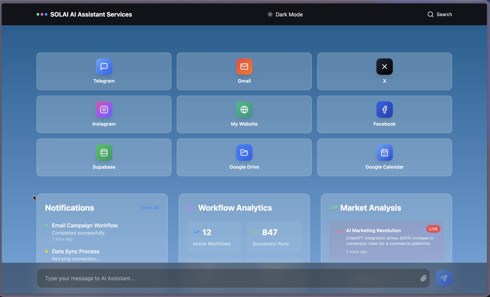
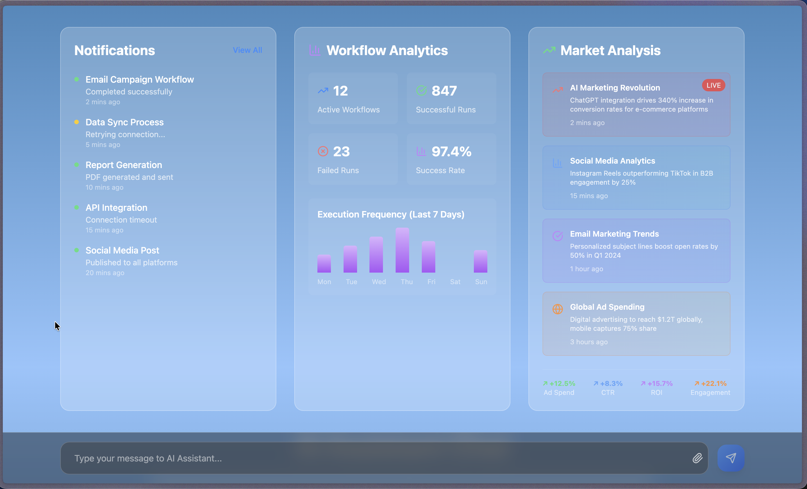
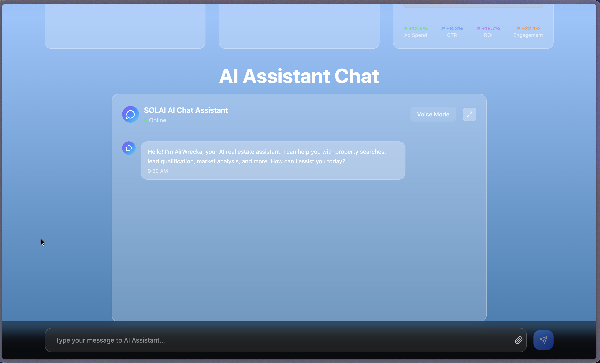
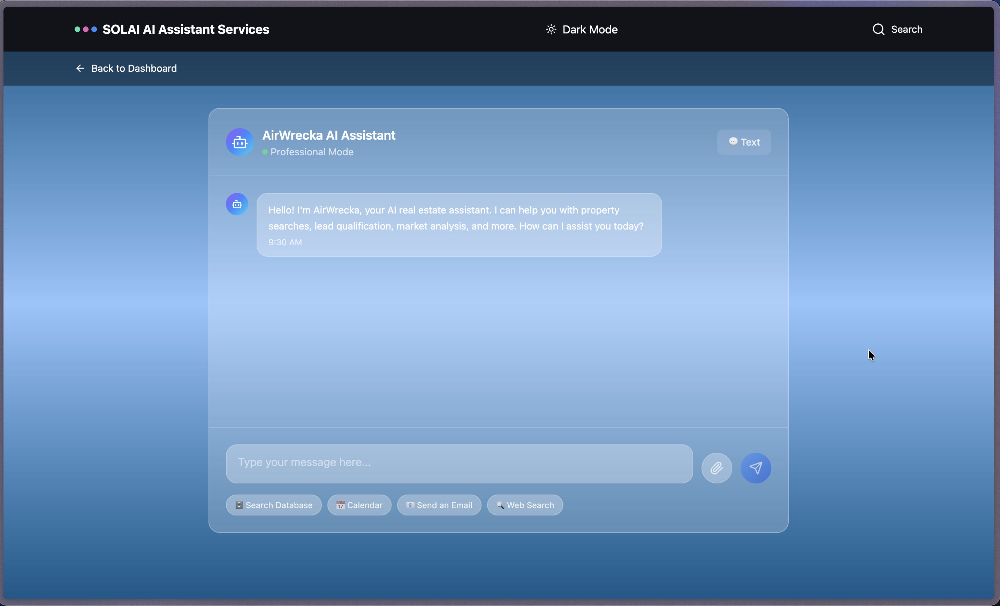
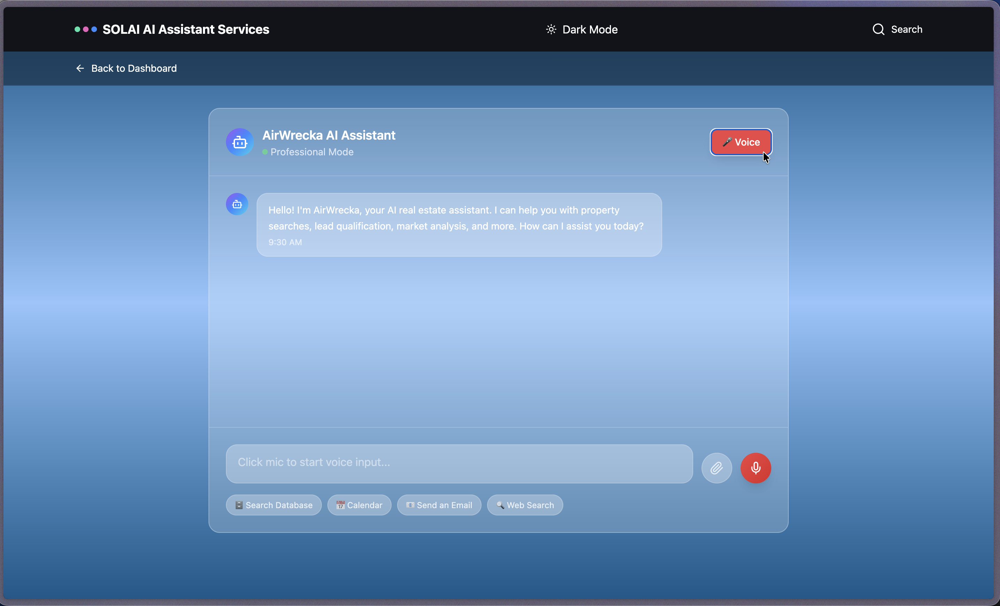
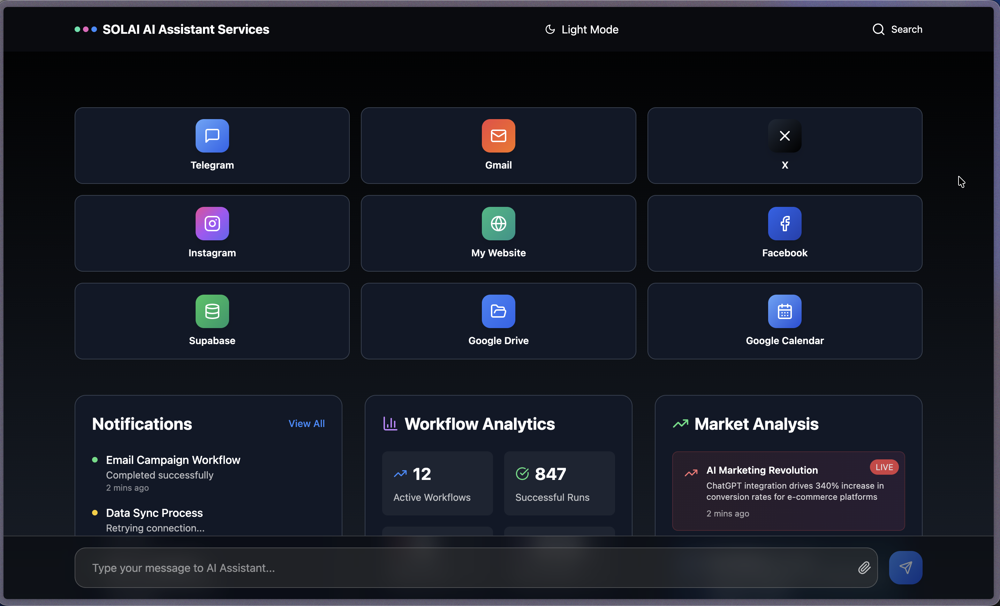
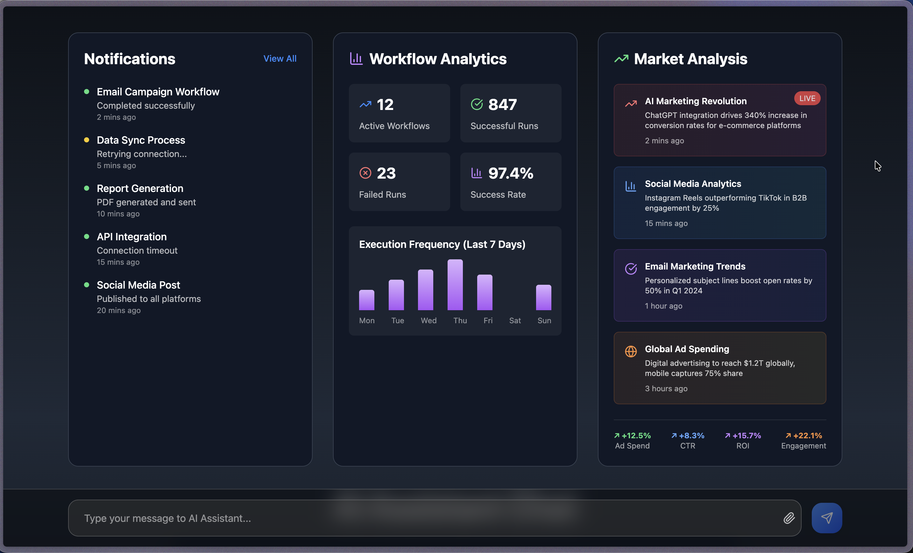
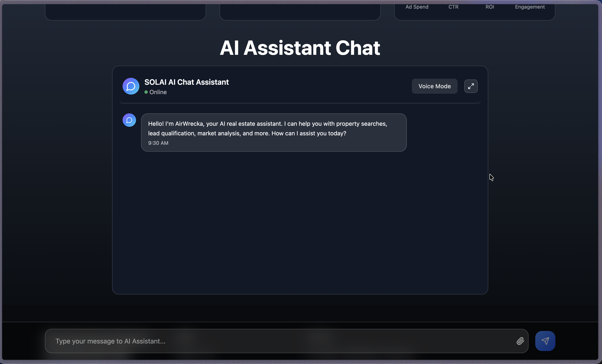
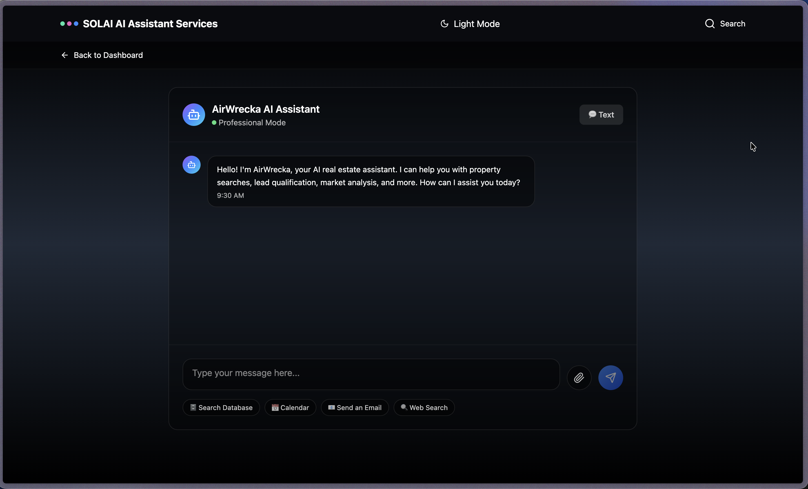
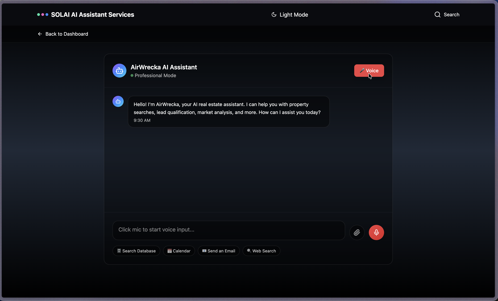

# SolAI_v2 Comprehensive Results Report

## 1. Project Overview
SolAI_v2 is an agentic AI assistant platform built for real-estate workflows, combining:
- Conversational reasoning (`ConversationEngine`, `EnterpriseConversationEngine`)
- Multi-tier memory (Redis + Supabase + semantic/vector memory)
- Adaptive personality and response strategy
- Tool orchestration across super-tools + MCP tools
- Task/reminder/workflow automation
- Real-time dashboard + WebSocket notifications
- Security sandbox + audit logging + compliance-oriented controls

This report reflects a full code walkthrough, README/docs context, and the dashboard screenshots you provided.

## 2. Complete Functionalities and Key Features

### A. Conversational Intelligence (Agent Brain)
Implemented in:
- `src/engine/conversation-engine.js`
- `src/engine/conversation-engine-v2.js`
- `src/domain/conversation/EnterpriseConversationEngine.js`

Core capabilities:
- Multi-intent pattern + semantic classification
- Real-estate specialized intents:
  - Property search
  - Lead generation
  - Email automation
  - SMS communication
  - Calendar management
  - Client management
  - Document processing
  - Market analysis
- Emotion/urgency detection and response adaptation
- Answer-first behavior with “no questions / concise mode” preference memory
- Conversation state tracking, context carry-over, and fallback responses

### B. Domain-Driven Conversation Model (Enterprise Layer)
Implemented in:
- `src/domain/conversation/entities/Conversation.js`
- `src/domain/conversation/valueObjects/Intent.js`
- `src/domain/conversation/valueObjects/MessageAnalysis.js`
- `src/domain/conversation/services/*`

Key features:
- Aggregate root conversation model
- Entity extraction and normalization (location, budget, property type, timeline, beds/baths)
- Message complexity scoring, urgency scoring, memory requirement scoring
- Domain events for conversation lifecycle

### C. Intent Intelligence + Semantic Understanding
Implemented in:
- `IntentClassificationService.js`

Key features:
- Semantic embedding-based intent match (OpenRouter embeddings)
- Pattern fallback classification
- Real-estate intent taxonomy
- Confidence scoring + contextual confidence boosts
- Entity extraction patterns for location/budget/property/timeline

### D. Conversation Flow Orchestration
Implemented in:
- `ConversationFlowManager.js`

Key features:
- Stateful flow machines for:
  - Property search
  - Client onboarding
  - Market analysis
- Transition conditions and action handlers
- Flow interruption, cancellation, recovery options
- Progress estimation and completion metrics

### E. Memory Architecture (Agent Memory)
Implemented in:
- `src/memory/memory-manager.js`
- `SemanticMemoryService.js`

Three-tier memory:
- Working memory (Redis / in-memory fallback)
- Session memory (Supabase conversations table)
- Semantic memory (vector store simulation + embedding retrieval)

Capabilities:
- Recent conversation retrieval
- Semantic similarity search + ranking + temporal decay
- Preference storage (`concise_mode`, `no_followups`, etc.)
- Fallback keyword search when semantic path unavailable

### F. Personality Engine (Adaptive Response Layer)
Implemented in:
- `src/personality/personality-engine.js`

Key features:
- Adaptive communication style profiling
- Answer-first system prompt
- Real-estate structured response template for buyer scenarios
- Concise-mode response shaping (word/section/bullet caps)
- Follow-up suppression when user prefers no extra questions
- Model setup:
  - Primary: Gemini 2.5 Flash via OpenRouter
  - Fallback: Claude 3.5 Haiku via OpenRouter
- Response caching + lazy model initialization

### G. Tool Orchestration (Agent Action Layer)
Implemented in:
- `src/tools/tool-orchestrator.js`
- `src/tools/EnterpriseToolOrchestrator.js`
- `src/tools/tool-orchestrator-v2.js`
- `src/tools/adapters/*`
- `src/tools/mcp-client.js`

Key features:
- Intent-to-tool routing
- Super-tool registry (Gmail, Twilio, Calendar, CRM, document processor, market analyzer)
- MCP registry/integration path (Claude Flow tooling)
- Execution strategies:
  - single
  - parallel
  - intelligent orchestration
- Caching, rate limiting, load balancing, circuit breaker, failover
- Security-gated execution and audit integration

### H. Task/Reminder/Workflow Automation
Implemented in:
- `tool-orchestrator.js` (task + notification + reminders + appointments)
- `src/automation/workflow-builder.js`

Key features:
- Task CRUD + status updates
- Workflow enrollment and template-based task generation
- Built-in workflow templates:
  - Buyer intake
  - Listing launch
  - Contract-to-close
- Natural language reminders:
  - “today / tomorrow / in X hours/minutes / on weekday” parsing
- Recurring reminders (daily/weekly/monthly)
- Calendar event creation + reminder notifications
- Appointment safety lifecycle:
  - Request → Realtor response → Lead confirmation → Final confirmation
  - Counter-offer handling
  - Avoids unsafe direct promises

### I. Notifications + Real-Time UX
Implemented in:
- Server API routes + WebSocket in `src/server.js`
- Frontend in `public/index.html`

Key features:
- `/api/notifications` retrieval with priority/date sorting
- Mark-as-read endpoint
- Real-time push via WebSocket registration by session
- Priority visual system (urgent/high/medium/low)
- Filters (all/urgent/today)

### J. Security, Audit, Compliance
Implemented in:
- `src/security/execution-sandbox.js`
- `src/security/EnterpriseExecutionSandbox.js`
- `src/security/audit-trail.js`

Key features:
- Operation allowlist/restriction rules
- Threat detection (injection, escalation, exfiltration, anomaly checks)
- Resource constraints and validation
- Security incident logging
- Cryptographic audit hash/signature chain
- Compliance-aware fields/framework mapping (SOX/GDPR/HIPAA/PCI-DSS)

### K. Admin Monitoring + Observability
Implemented in:
- `src/api/admin-routes.js`
- `public/admin.html`
- `src/monitoring/health-monitor.js`

Key features:
- Admin metrics endpoints (API optimization, business logic events, safety logs)
- Export and reset metrics
- Test-suite trigger endpoint
- Health endpoint and component checks
- Rich logging with Winston

### L. Deployment, Setup, and Validation Tooling
Implemented in:
- `scripts/*.js`
- `tests/*.js`

Capabilities:
- Enterprise startup scripts (integrated Redis + MCP)
- Database setup and schema bootstrap
- Migration path toward enterprise tool stack
- Conversation engine v2 deployment helper
- Basic and enterprise validation suites

### M. Data Model / Persistence
Implemented in:
- `database/supabase-schema.sql`

Tables include:
- `conversations`
- `user_preferences`
- `system_metrics`
- `tool_usage`
- `tasks`
- `workflow_templates`
- `workflow_instances`
- `notifications`

With indexing, cleanup functions, and RLS policy scaffolding.

## 3. How Agentic AI Is Used in SolAI_v2
SolAI_v2 expresses an agent loop in production-like form:
1. Perceive:
- Parse user message, detect intent/entities/emotion/urgency.
2. Remember:
- Pull short-term + session + semantic context.
3. Plan:
- Choose response strategy + whether/which tools/workflow should run.
4. Act:
- Execute coordinated tools/workflows (single/parallel/orchestrated).
5. Reflect/Learn:
- Record analytics, update memory, update performance/security/audit signals.
6. Adapt:
- Modify tone/verbosity/follow-up behavior based on user profile + explicit preferences.

This is exactly what makes it “agentic” rather than a simple chatbot.

## 4. Dashboard Results (Screenshots)
The screenshots show:
- Service cards for connected channels/tools (Telegram, Gmail, X, Instagram, website, Facebook, Supabase, Drive, Calendar)
- Notification center with operational events
- Workflow analytics (active workflows, successful/failed runs, success rate, execution chart)
- Market analysis cards with trend snippets
- AI chat panel with mode switching (Text/Voice)
- Dark/light theme variants
- Bottom global quick-chat bar

### Screenshot Gallery

#### 1) Main services dashboard (light)

#### 2) Analytics + notifications detail (light)

#### 3) AI assistant chat focus (light)

#### 4) Assistant detail view (text mode)

#### 5) Assistant detail view (voice mode)

#### 6) Main services dashboard (dark)

#### 7) Analytics + notifications detail (dark)

#### 8) AI assistant chat focus (dark)

#### 9) Assistant detail view (text mode, dark)

#### 10) Assistant detail view (voice mode, dark)

## 5. Full Project Potential (Business + Product)
With current architecture, SolAI_v2 can scale into:
- Full real-estate AI operations copilot (lead intake → nurturing → meeting scheduling → contract workflows)
- Multi-channel communication hub (email/SMS/voice/social)
- Automated reminder and process compliance system for agents/teams
- Real-time team operations board with proactive notifications
- Enterprise-grade governed AI with audit/compliance controls
- Extensible tool marketplace via adapters + MCP-based capability discovery

## 6. Notes on Current State vs Potential
The codebase includes both:
- Strong enterprise architecture for agentic orchestration
- Some mocked/simulated tool action payloads in adapters (useful for staging/demo, replaceable with production APIs)

So the project already demonstrates strong agentic design and operational workflows, and is structured to mature into a fully production-hardened enterprise platform.

---
